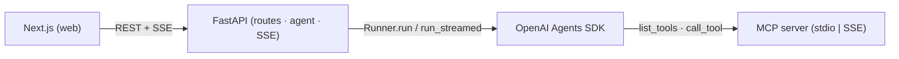

# MCP Agent

An MCP-driven agent. FastAPI backend + Next.js frontend, both on Google
Cloud Run.

## How it works



## Quick start

```bash
cp .env.example .env  # OPENAI_API_KEY, MCP_SERVER_URL, LANGFUSE_*
make dev              # api on :8000, web on :3000
make test             # pytest + tsc
```

## Endpoints

```
GET  /health
POST /agent/run             # synchronous
GET  /agent/stream?prompt=  # SSE
```

## Deploy

Push to `main`. GitHub Actions runs `lint-test`, `build-push` (matrix), and
`deploy` (matrix) to Cloud Run via Workload Identity Federation. No JSON keys.

## License

MIT
