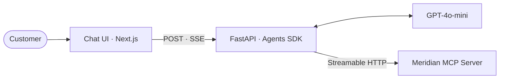

# Meridian Support Chatbot

A customer support chatbot for Meridian Electronics. FastAPI backend running
the OpenAI Agents SDK against an MCP server, Next.js chat frontend, both on
Google Cloud Run.

## How it works



## Quick start

```bash
cp .env.example apps/api/.env  # OPENAI_API_KEY required, MCP_SERVER_URL preset
make dev                        # api on :8000, web on :3000 via docker compose
make test                       # pytest + tsc + eslint
```

## Endpoints

```
GET  /health
POST /agent/chat                # full reply, JSON
POST /agent/stream              # SSE: tool_call, tool_result, final
```

Body shape: `{"messages": [{"role": "user|assistant", "content": "..."}]}`.

## Deploy

Push to `main`. GitHub Actions runs `lint-test`, `build-push` (matrix), and
`deploy` (matrix) to Cloud Run via Workload Identity Federation. No JSON keys.

## License

MIT
