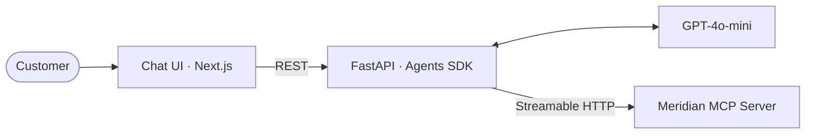

# Meridian Electronics customer support chatbot

```mermaid
flowchart LR
  Customer(["Customer"])
  UI["Chat UI · Next.js"]
  API["FastAPI · Agents SDK"]
  LLM["GPT-4o-mini"]
  MCP["Meridian MCP Server"]

  Customer --> UI
  UI -- "REST" --> API
  API <--> LLM
  API -- "Streamable HTTP" --> MCP
```