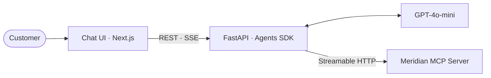

# Video 1: Kickoff

## Architecture

## Script

### Intro

Hi, I'm Caleb. I'm walking through my plan for the Meridian Electronics customer support chatbot before I start building.

### The business problem

Meridian's support team is handling every customer request by phone and email: stock checks, order placement, order history, customer lookup. Most of those are routine and repeatable, the kind of work a chatbot does well. The pitch from leadership is to take that routine 80% off the human team, so people can focus on the cases that actually need a person.

The backend team already did the right thing here. Instead of letting a chatbot reach into the database, they wrapped the business logic in an MCP server. My job is the chat layer that uses it.

### Plan of attack

[show diagram]

A Next.js chat UI for the customer. A FastAPI backend running the OpenAI Agents SDK. The agent calls Meridian's MCP server over Streamable HTTP and streams tool calls back to the UI. The model is GPT-4o-mini, because the brief is clear that per-conversation cost has to stay low. Both services run on Google Cloud Run, deployed through GitHub Actions over Workload Identity Federation. No service account keys.

I'm building in three steps:

1. Connect to the MCP server and list its tools, so I know exactly what I'm working with before I write any agent code.
2. Wire the customer auth flow with email and PIN. The agent refuses to touch any order data until the customer is authenticated. That's the security gate.
3. Build the chat UI with streaming, so the demo shows tool calls happening live.

### What I cut if time runs short

The eval harness beyond a smoke test. UI polish. Anything not on the path to a working live demo. The infra was pre-baked, so I'm not spending the first hour standing up Cloud Run. That's where the time savings come from.

### Wrap

Back in about an hour and fifteen minutes with the mid-point check-in.
